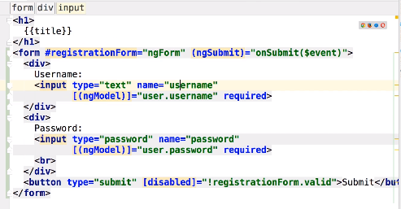
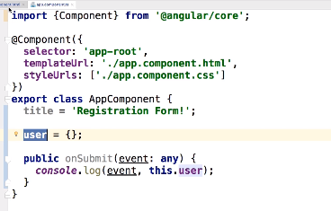
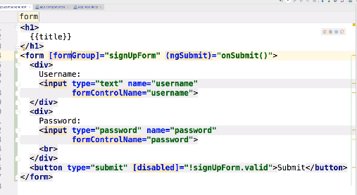
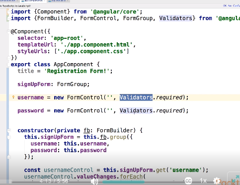
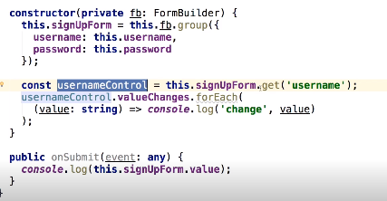
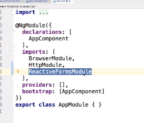
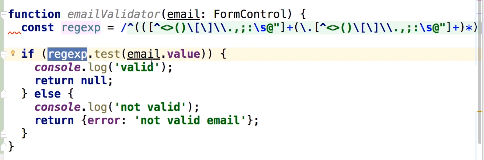
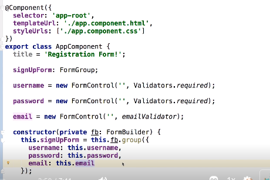
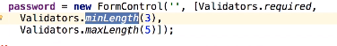
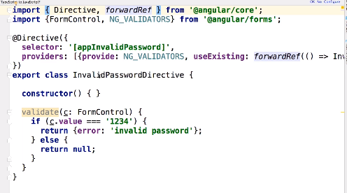

## Forms:

### Usual Form:

- Html:



- Typescript:




### Reactive Forms:

- Html:



- Typescript:





- Add `ReactiveFormsModule` to `NgModule`:



https://angular.io/guide/reactive-forms


## Form Validation:

- Use Function Validation when validating `ReactiveForms`.
- Use Validation Directives when validating `TemplateForms`.

```typescript
ng-touched ng-unthouched // 
ng-valid ng-invalid // value is valid?
ng-dirty ng-pristine // value has been changed?
```

- Validation Fuction:







- Validation Directive:




