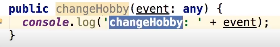

# AngularJS:

## Input and Output Parameters:

- On component page:


- On component Typescript file:




- On destination page:


```typescript
// Input:
[name]="name" to Page <- from Component @Input() name: string;

// Output:
(changeHobby)="changeHobby($event)" from Page -> to Component public keyUp(event: any){...}
```

