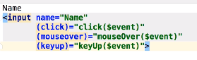
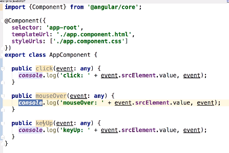
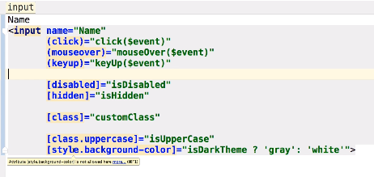
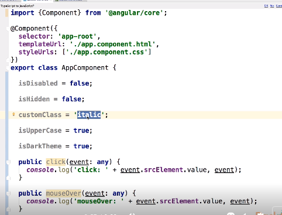
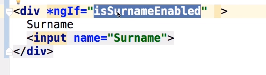
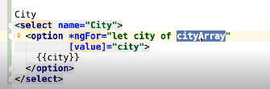
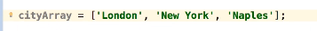
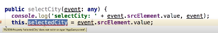
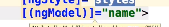

# AngularJS:

## Templates:

### Events:

- Map page events to methods in the component:

### Attributes:

- Map attributes to methods:

## Structural Directives:

- `ngIf` binded to a variable on the component:

- `ngFor` binded to a variable;

- `ngSwitch` binded to a variable and method:

### Bi-Directional Bindings:

