# Angular JS:


## Router:

### Events:

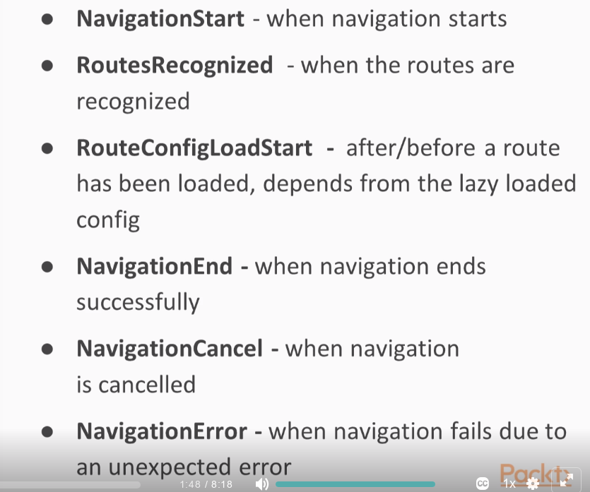

- Create an application with a routing file:

```shell
ng new sample1 --routing
```

- Create login component:

```shell
ng g component login
```

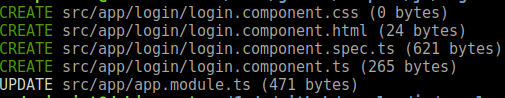

- redirection:

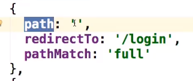

- Navigation:

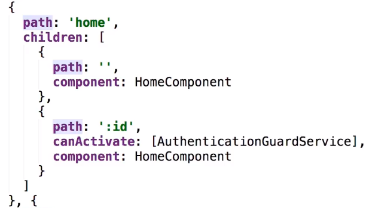

### Guards

- Add condition to Navigation

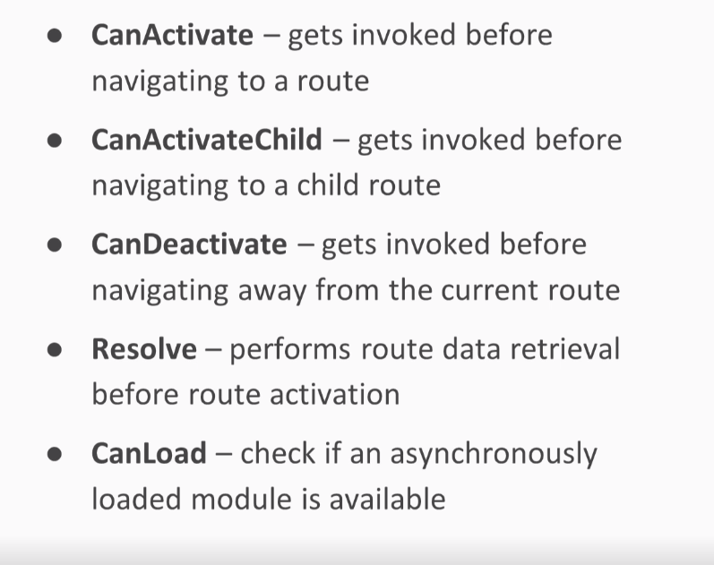


-  Create authentication guard:

```shell
ng g service AuthenticationGuard
```

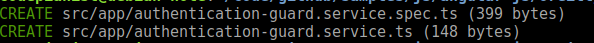

- DeactivateGuard:

```shell
ng g service DeactivateGuard
```

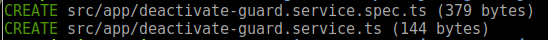

### Angular CLI:

- Installation instructions: https://github.com/angular/angular-cli/wiki
- 


#### Start the application:

```shell
ng serve
```


### Observable, Subjects and Promisses:

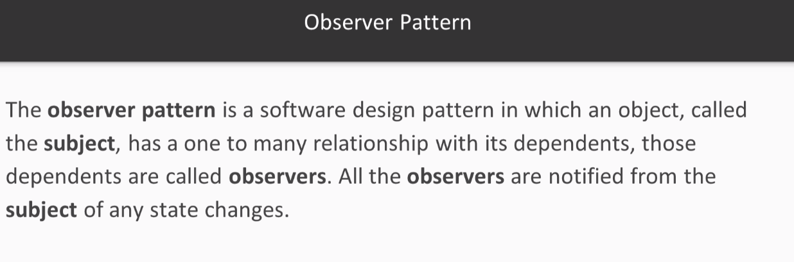


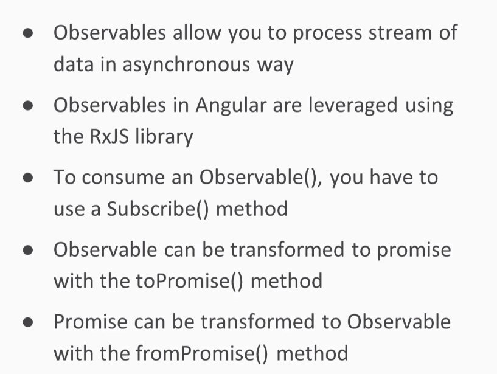

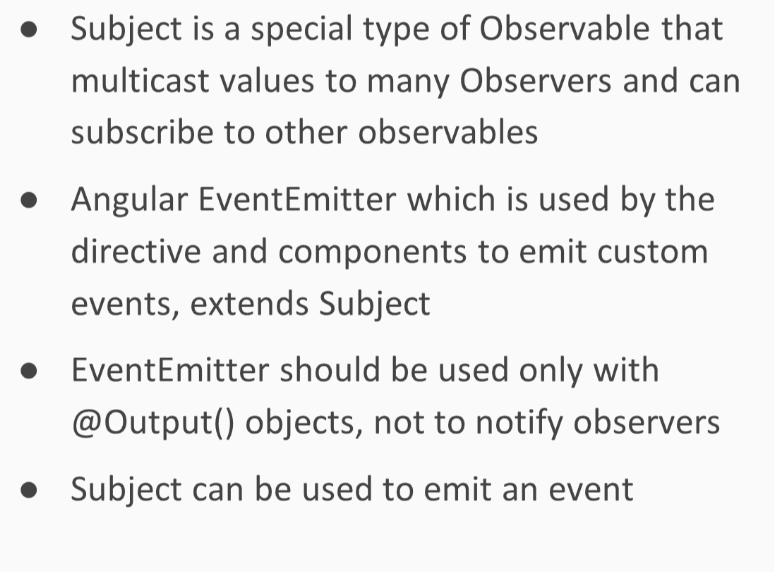


### Create an app:

- Create the app skeleton:

```shell
ng new angular-tour-of-heroes
```

- Build and run (`--open` opens the default browser).

```shell
ng serve --open
```


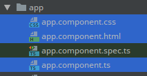

- Add global styles to: `src/styles.css`

#### Create a component:

```shell
ng generate component heroes
```

- A folder `src/app/heroes/` was created:

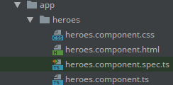

- component:

```typescript
import { Component, OnInit } from '@angular/core';

@Component({
  selector: 'app-heroes',
  templateUrl: './heroes.component.html',
  styleUrls: ['./heroes.component.css']
})
export class HeroesComponent implements OnInit { // Always export the component class so you can import it elsewhere ... like in the AppModule.

  constructor() { }

  ngOnInit() {
  }

}
```

- `@Component` is a decorator function that specifies the Angular metadata for the component.
- The `ngOnInit` is a [lifecycle hook](https://angular.io/guide/lifecycle-hooks#oninit). Angular calls `ngOnInit` shortly after creating a component. It's a good place to put initialization logic.


- Add hero property to heroes template `src/app/heroes/heroes.component.html`:

```
{{hero}}
```


- Add the hero component to the app template `src/app/app.component.html`:

```
<h1>{{title}}</h1>
<app-heroes></app-heroes>
```


- Use pipes to format Strings: https://angular.io/guide/pipes

```html
<h2>{{hero.name | uppercase}} Details</h2>
```


- Import FormsModule on `src/app/app.module.ts`:

```typescript
import { FormsModule } from '@angular/forms';
...
@NgModule({
  declarations: [
    AppComponent,
    HeroesComponent
  ],
  imports: [
    BrowserModule,
    FormsModule
  ],
  providers: [],
  bootstrap: [AppComponent]
})
export class AppModule { }
```


