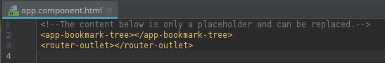
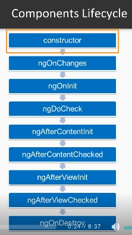

# Angular JS

## Create a component:

```shell
ng generate component components/bookmark-tree 
ng g c components/bookmark-tree
```

- It creates these files:


- Adds components to `app.module.ts`:

  

- Add Selector to a page:




## Lifecycle:

- https://angular.io/guide/lifecycle-hooks

