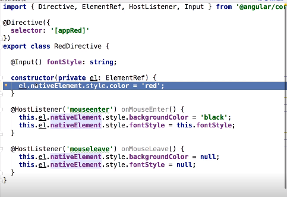
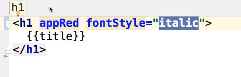
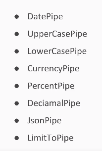
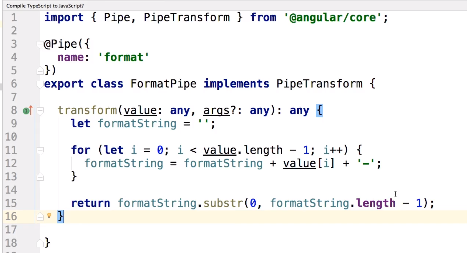
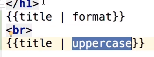

## Directives:

### Angular has 3 types of Directives:

- Component;
- Attributes- to change appearance or  behavior; Can receive 1 or more input parameters; Can listen on DOM events;
- Structural.

### Create an directive:

```shell
ng generate directive red 
ng g d red
```

- The Directive (`@Directive`):



- The Page:




## Pipes:

- Transforms input data to a desired output.
  - `@Pipe`

### Built-in Pipes:




- Pipe Typescript:



- Pipe html:



