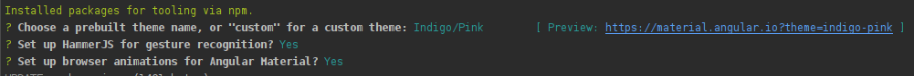

##Angular Material:

- https://material.angular.io/
- Git hub: https://github.com/angular/material2
- Developed by Angular Team Google;
- A Suite of commonly uses pre-build components and style;
- Follow the material design spec;
- Packages:

```typescript
@angular/cdk // Component Development Kit - Use for create your own components.
@angular/material // Concrete Components Implementations
```


#### Install `@angular/cdk` and `@angular/material`:

```shell
# Material and CDK
# npm install --save @angular/material @angular/cdk
npm install --save @angular/material @angular/cdk @angular/animations
npm install --save hammer.js # enables Gesture for mobile devices
```


### Add Angular Material to your project:

```shell
ng add @angular/material
```

- Answer the questions:




#### With Angular you have to explicitly add all features you want to use:

- At `app.module.ts`:

```typescript
import { BrowserAnimationsModule } from '@angular/platform-browser/animations';
...
@NgModule({
  declarations: [ ... ],
  imports: [
	...
    BrowserAnimationsModule
  ],
  ...
```

- Select a pre-built template:

```css
@import "~@angular/material/prebuilt-themes/indigo-pink.css";
@import "~@angular/material/prebuilt-themes/deeppurple-amber.css";
@import "~@angular/material/prebuilt-themes/pink-bluegrey.css";
@import "~@angular/material/prebuilt-themes/purple-green.css";
```


- Import `hammer.js` to add Gesture for mobile users:

```typescript
import 'hammer.js';
```

- Import Angular Material Icons: https://material.io/tools/icons/?style=baseline

```html
/* Angular Material Icons */
<link href="https://fonts.googleapis.com/icon?family=Material+Icons" rel="stylesheet">
```


#### Examples:

##### Button:

- Html:

```html
<button mat-button color="accent">Click Me</button>
<button mat-raised-button color="accent">Click Me</button>
<button mat-icon-button color="accent">
  <mat-icon>home</mat-icon>
</button>
```

- Import:

```typescript
import { MatButtonModule, MatIconModule } from '@angular/material'
```


#### Flexbox:

- A package that uses CSS Flexbox: 
- Git hub: https://github.com/angular/flex-layout
- Demos: https://tburleson-layouts-demos.firebaseapp.com/#/docs
- Installation:

```shell
npm install @angular/flex-layout --save
```

- Import at `app.module.ts`:

```typescript
import { FlexLayoutModule } from '@angular/flex-layout';
...
@NgModule({
  declarations: [...],
  imports: [
	...
    FlexLayoutModule
  ],
  providers: [],
  bootstrap: [AppComponent]
})
export class AppModule { }

```


##### `FormsModule`:

- Declaration:

```typescript
import { FormsModule } from '@angular/forms';
...
@NgModule({
  declarations: [...],
  imports: [
	...
    FormsModule
  ],
  providers: [],
  bootstrap: [AppComponent]
})
export class AppModule { }
```

- Html:

```html
<section>
  <form fxLayout="column" fxLayoutAlign="center center" #f="ngForm"
    (ngSubmit)="onSubmit(f)">
    <mat-form-field class="sign-up-field">
      <input matInput type="email" ngModel name="email" placeholder="Email" >
    </mat-form-field>
    <mat-form-field class="sign-up-field">
      <input matInput type="password"  ngModel name="password" placeholder="Password">
    </mat-form-field>
    <button type="submit" mat-raised-button color="primary">Submit</button>
  </form>
</section>
```

- Component:

```typescript
...
import { NgForm } from '@angular/forms';

@Component({
  selector: 'app-signup',
  templateUrl: './signup.component.html',
  styleUrls: ['./signup.component.css']
})
export class SignupComponent implements OnInit {

  onSubmit(form: NgForm) {
    console.log(form);
  }

  // ...

}
```


##### DatePicker:

```html
<mat-form-field class="sign-up-field">
    <input matInput [matDatepicker]="picker" [matDatepickerFilter]="dateFilter" placeholder="Birth date" required >
    <mat-datepicker-toggle matSuffix [for]="picker"></mat-datepicker-toggle>
    <mat-datepicker #picker></mat-datepicker>
    <mat-error *ngIf="picker.innerText?.length > 0">Cannot be empty!</mat-error>
</mat-form-field>
```


```typescript
// filter
dateFilter = (date: Date) => {
    const adultLimit = new Date();
    adultLimit.setFullYear(adultLimit.getFullYear() - 18);
    console.log(`t= ${adultLimit}, d= ${date}`);
    return adultLimit > date;
}
```


##### Hints and Validation Errors:

```html
<section>
  <form fxLayout="column" fxLayoutAlign="center center" #f="ngForm"
    (ngSubmit)="onSubmit(f)">
    <mat-form-field class="sign-up-field">
      <input matInput type="email" name="email" placeholder="Email" ngModel email required #emailInput="ngModel">
      <mat-error *ngIf="emailInput.hasError('email')">Email is invalid!</mat-error>
      <mat-error *ngIf="emailInput.hasError('required')">Cannot be empty!</mat-error>
    </mat-form-field>
    <mat-form-field class="sign-up-field" >
      <!-- mat-hint="Should be at least 6 characters long."> -->
      <input matInput type="password" name="password" placeholder="Password" ngModel required minlength="6" #pwInput="ngModel" >
      <mat-hint align="end">{{ pwInput.value?.length }}/ 6.</mat-hint>
      <mat-error *ngIf="pwInput.hasError('required')">Cannot be empty!</mat-error>
      <mat-error *ngIf="pwInput.hasError('minlength')">Should be at least 6 characters long, you typed {{ pwInput.value?.length }}!</mat-error>
    </mat-form-field>
    <button type="submit" mat-raised-button color="primary">Submit</button>
  </form>
</section>
```

