# Angular:

- A Javascript Framework for client side web apps;
- SPAs- Single Page Applications (Mobile Like) One Page + Javascript Files: One Page which State is handled by the browser asynchronously;
- High Scalable an Performance

- Supported by Google.

  

## Concepts:

- Component Driven Application;
- Created in `TypeScript`, same creator of C#, and uses it ;
- Everything that you need is included.
- Angular CLI to accelerate development.


### Angular 1.x vs 2.x:

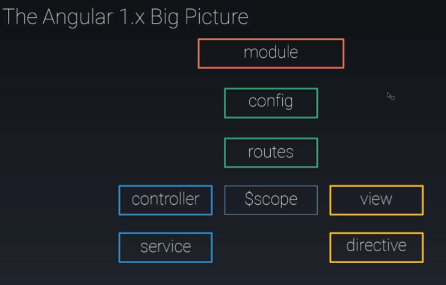


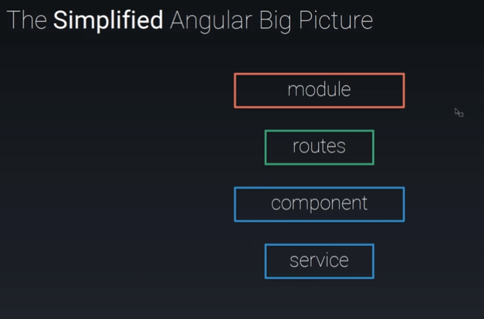


| **ngular 1x**                                                | **Angular 2x**                                               |
| ------------------------------------------------------------ | ------------------------------------------------------------ |
| 1. Uses many tags like ng-href, ng-src, ng-show and ng-hide  | All these directives are no longer required                  |
| 2. Can use languages like ES5, ES6 and Dart                  | TypeScript                                                   |
| 3. Controllers and scopes are used                           | Controllers are replaced with Components                     |
| 4. Has 2 ways to bootstrap angular via code and ng-app.      | The only way to bootstrap angular is via code.               |
| (The bootstrap function is used and it takes starting component which is also parent component of your angular application.) |                                                              |
| 5. To filter output in templates, we use the pipe character (\|) and one or more filters | In Angular 2 they are called pipes. The syntax remains same. |
| 6. Was not built with mobile support                         | Mobile oriented                                              |
| 7. Event binding is done as <button ng-click="doSomething()"> | Event binding is done as <button (click)="doSomething()">    |
| 8. ng-bind is used for one way data binding                  | ng-bind is replaced with [property]                          |
| 9. ng-model is used for two way data binding                 | ng-model is replaced with [(ngModel)]                        |
| 10. we can define a [service](https://docs.angularjs.org/guide/services) via 5 different ways.FactoryServiceProviderConstantValues | class is the only way to define a service                    |
| 11 Dependency Injection is achieved using controller function arguments | DI is achieved using Constructor                             |
| 12. $routeProvider.when() is used to configuring routing.    | @RouteConfig{(...}) is used to configuring routing.          |
| 13. Structural directives like ng-repeat, ng-if are used     | Structural directives like #ngfor, *ngif are used            |


### Setup:

- Install Angular CLI:

```shell
npm install -g @angular/cli
```

- Install Node JS:

```

```


### TypeScript:

#### Interfaces:

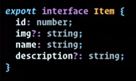

#### Classes:

- Members: Available with the class.


- Constructors: Arguments are also available with the class.

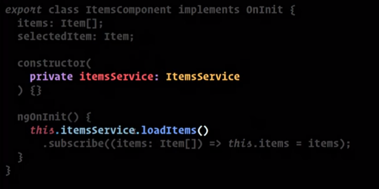

- Implementing an interface (Angular Lifecycle Hook):


### Angular CLI:

- Removes the pain (!== Crutch).
- Avoids Javascript Fatige:

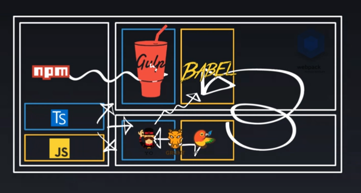


#### Commands:

```shell
# Create new application
ng new hello-angular
cd hello-angular
# compile and run
ng serve

# Create a component
ng generate component <component-name>
ng g component <component-name> # using alias
# Options
# --dry-run or -d # Emulates no changes are made
# --force or -f # Forces overwrite

# Create a service
ng g service shared/entries


# other
ng build
ng test
ng e2e # end-to-end test
ng lint

```


#### The Bootstrap // Application's start:

- It occurs on `main.ts`:

```typescript
// ..
platformBrowserDynamic().bootstrapModule(AppModule)
  .catch(err => console.error(err));

```


### Modules:

- ES6 module syntax (import/ export)


#### `NgModule`:

- `declarations`- Your project's modules.
- `imports`: Directives or utilities modules.
- `providers`: Injectable.
- `bootstrap`: The component that will bootstrap the application.

```typescript
@NgModule({
  declarations: [
    AppComponent,
    HeroesComponent,
    HeroDetailComponent,
    MessagesComponent,
    DashboardComponent
  ],
  imports: [
    BrowserModule,
    FormsModule,
    AppRoutingModule
  ],
  providers: [ItemsService],
  bootstrap: [AppComponent]
})
export class AppModule { }
```

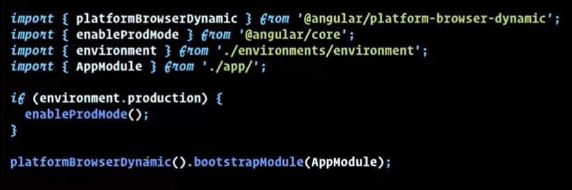


### Components:

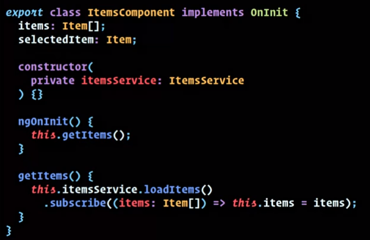

- Composed of Template + Class.

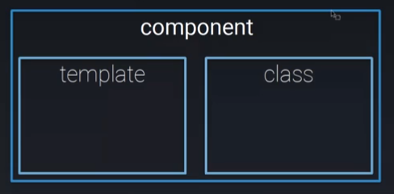

- Methods and properties are available to template.
- Services are available by injection in the constructor.

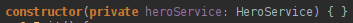

- Linked by decorators (@)

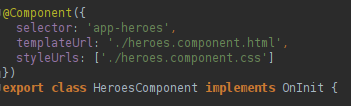

- Can have Lifecycle Hooks.


#### Templates:

##### Can be: inlined or declared file.

- Declared file:

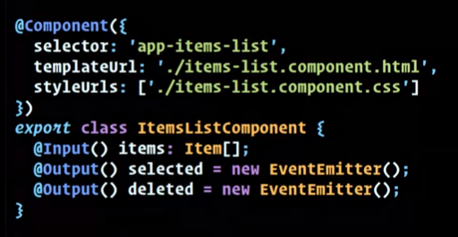

- Inlined:

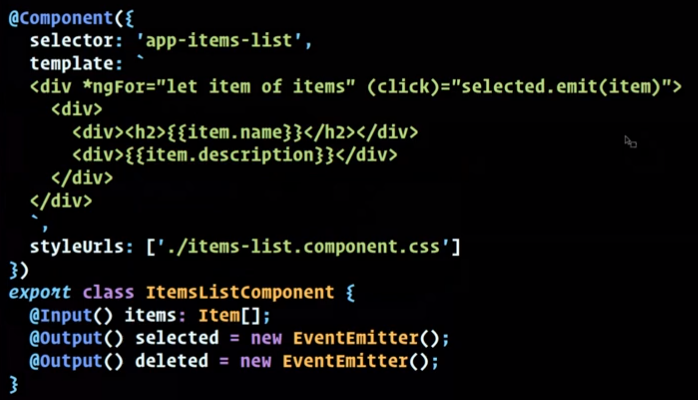


##### Data binding:

- Can be Interpolation, property binding, event binding, two-way property/event binding.

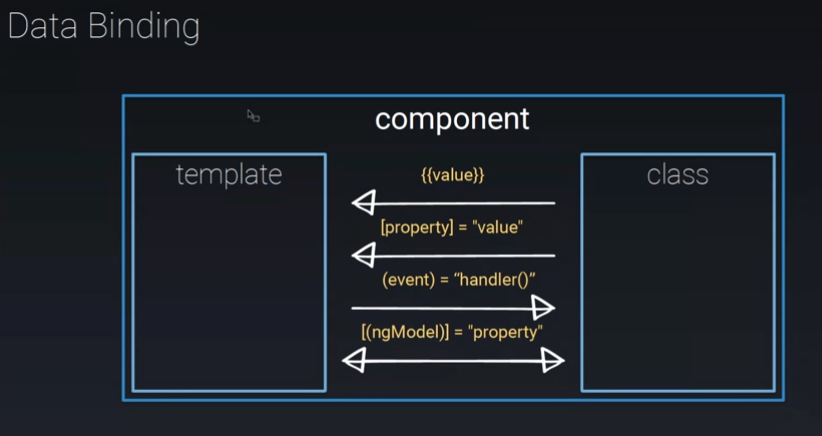

- Use `[]` to access a property and `()` to access methods:

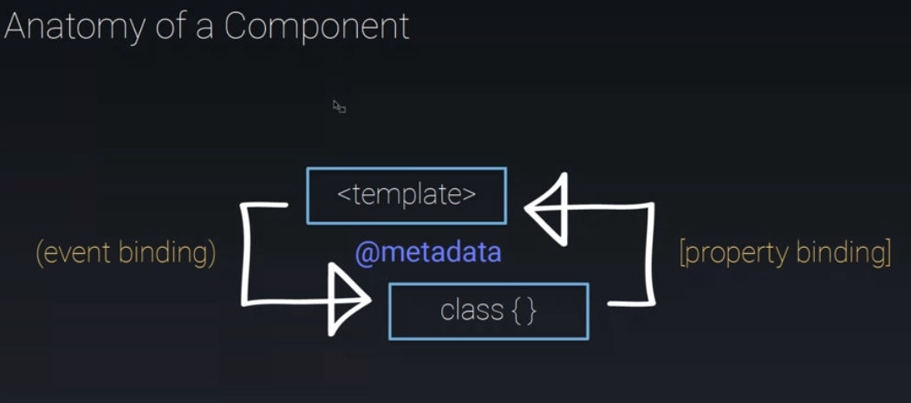

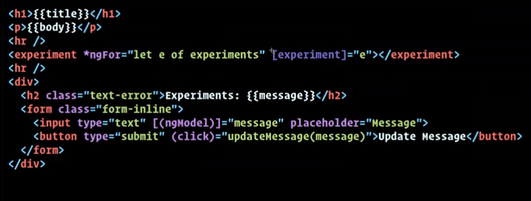


##### Property Binding:

- Html:

```html

<span [style.color]="componentColor">Some colored text!</span>
```

- TypeScript:

```typescript
import { Component, OnInit } from '@angular/core';

@Component({
  selector: 'app-dashboard',
  templateUrl: './dashboard.component.html',
  styleUrls: ['./dashboard.component.css']
})
export class DashboardComponent implements OnInit {
  image= {
    "src" = "imgs/defaultImage.png"
  };
  componentColor= 'red';
  constructor(private dashboardService: DashBoardService) { }

  ngOnInit() {
    this.getHeroes();
  }

  getHeroes(): void {
    this.heroService.getHeroes()
      .subscribe(heroes => this.heroes = heroes.slice(1, 5));
  }

}
```

135

- Accessing attributes, classes and styles:

```html
[attr.property], [class.className], [style.styleName]
```


##### Event Binding:

- Examples:

```html
<button type="button" (click)="foo($event)">Do something</button>
<button type="button" (click)="save.emit(selectedItem)">Save</button>
```

- Reference: https://developer.mozilla.org/pt-BR/docs/Web/Events


##### Two-way binding:

- Used in conjunction with `ngModel`
- Examples:

```html
<input type="text" [(ngModel)]="dinamicValue" placeholder="..." /> 
<span>{{dinamicValue}}</span>
```


#### Directives:

- A class decorated with `@Directive`.
- A component is a Directive.
- Built-in directives include structural directives and attribute directives.

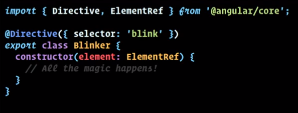


#### Structural Directives:


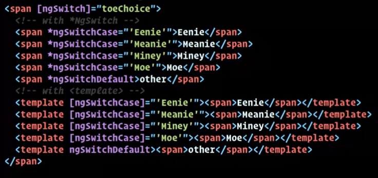

- 

```typescript
*ngIf="!isDisabled"
```


#### Custom Property:

- On component:

```typescript
import { Component, OnInit, Input } from '@angular/core';

//...
@Input() productName: string;
```

- On Html:

```html
<!-- app.products.html -->
<app-product *ngFor="let product of products" [productName]="product"></app-product>

<!-- app.product.html -->
<article>
    <h2>{{productName}}</h2>
    <p>Excellent product!</p>
</article>
```


##### Passing data to a child component:

https://angular.io/guide/component-interaction

- Parent:

```html
<mat-sidenav-container>
  <mat-sidenav #sidenav role="navigation" >
    <mat-nav-list> <!-- ... --> </mat-nav-list>
  </mat-sidenav>
  <mat-sidenav-content>
    <app-top-bar [applicationTitle]="applicationTitle" 
      (openSideBarEvent)="sidenav.toggle() "></app-top-bar>
    <main>
      <router-outlet></router-outlet>
    </main>
  </mat-sidenav-content>
</mat-sidenav-container>
```

```typescript
export class AppComponent {
    applicationTitle = 'Easy Bookmark';
}
```


- Child:

```html
<mat-toolbar color="primary" >
  <div fxHide.gt-xs >
    <button mat-icon-button (click)="onClickOpenSideMenu()">
      <mat-icon>menu</mat-icon>
    </button>
  </div>
  <div><h1>{{ applicationTitle }}</h1></div>
  <nav fxFlex fxLayout fxLayoutAlign="end center" fxHide.xs >
    <ul fxLayout fxLayoutGap="10px" class="toolbar-items">
      <li><a routerLink="/">Home</a></li>
      <li><a routerLink="/bookmarks">Bookmarks</a></li>
      <li><a routerLink="/sign-up">Sign Up</a></li>
      <li><a routerLink="/log-in">Log in</a></li>
      <li><a routerLink="/log-out">Log out</a></li>
    </ul>
  </nav>
</mat-toolbar>
```

```typescript
import {Component, Input, OnInit} from '@angular/core';
// ..

@Component({
  selector: 'app-top-bar',
  templateUrl: './top-bar.component.html',
  styleUrls: ['./top-bar.component.css']
})
export class TopBarComponent implements OnInit {
  @Input() applicationTitle: string;
  // ...
}
```


#### Events:

- On component:

```typescript
import { Component, OnInit, Output, EventEmitter } from '@angular/core';

//...
@Output() productClicked= new EventEmitter();

onClicked(){
    this.productClicked.emit();
}
removeProduct(product: string){
    this.products= 
    	this.products.filter(p=> p !== productName );
}
```

- On Html:

```html
<!-- app.products.html -->
<app-product (productClicked)="removeProduct(product)"  *ngFor="let product of products" [productName]="product"></app-product>

<!-- app.product.html -->
<article>
    <h2>{{productName}}</h2>
    <p>Excellent product!</p>
</article>
```


#### Forms:

```html
<form >
	<input type="text" [(ngModel)]="productName" />
    <button type="submit">Add Product</button>
</form>
<!-- or -->
<form (ngSubmit)="onAddProduct(f)" #f="ngForm" > <!-- Access to form object -->
	<input type="text" ngModel name="productName" required />
    <button type="submit">Add Product</button>
</form>
```

```typescript
onAddProduct(form){
    console.log(form);
    if(form.valid) {
        this.products.push(form.value.productName)
    }
}
```


### Services

- It's a class that provides a specific functionality.
- It's a best practice to use `@Injectable` with them.

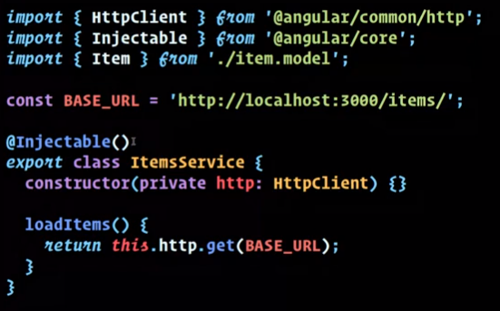


- Lifecycle Hooks:

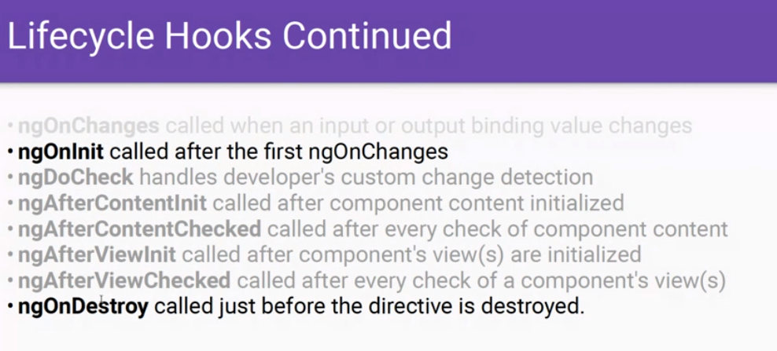

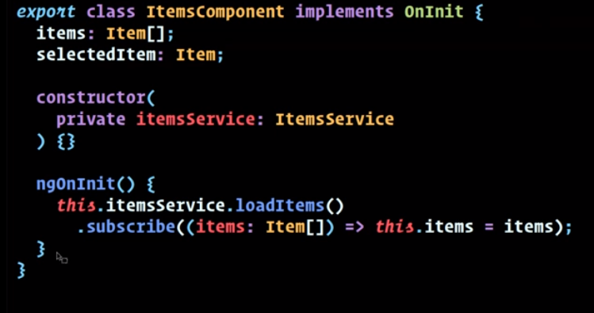


