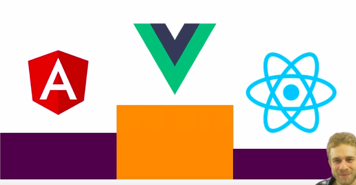
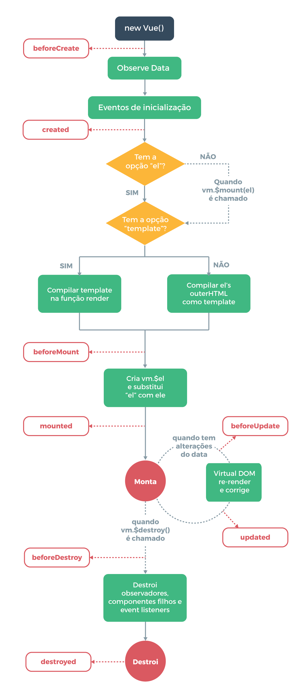
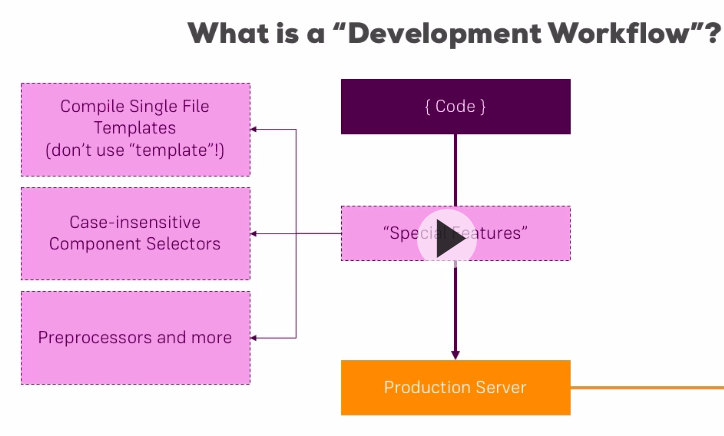

# VueJS:


- Extreme Lean and Small 16kb.
- Performance beats angular and React:




## Accessing data and methods from interface:

### Simple example - 190528.1:

- Access property from `data`;
- Calling a method from `methods` and passing an event;

#### `index.html`:

```html
<script src="https://cdn.jsdelivr.net/npm/vue/dist/vue.js"></script>
<script src="script.js"></script>
<div id="app">
	<input type="text" v-on:input="changeTitle" />
	<p id="result">{{ title }}</p>
</div>

```


#### `script.js`

```js
window.onload = _ => {
	new Vue({
		el: '#app',
		data: {
			title: 'Hello World!'
		},
		methods: {
			changeTitle: function(e) {
				this.title = e.target.value; // Nao use arrow functions. 
				// Como as arrow functions são vinculadas ao contexto pai, this não representará a instância Vue como você pode esperar.
				console.log(`[target: ${e.target.value}, title: ${this.title}]`);
				// document.getElementById('result').innerHTML = e.target.value; // alternative
			}
		}
	});
};
```


### `Object.freeze`:

- Prevents existing properties from being modified.

```js
var obj = {
  foo: 'bar'
}

Object.freeze(obj)

new Vue({
  el: '#app',
  data: obj
})
```


### Built-in properties and methods:

```js
var data = { a: 1 }
var vm = new Vue({
  el: '#exemplo',
  data: data
})

vm.$data === data // => true
vm.$el === document.getElementById('exemplo') // => true

// $watch é um método da instância
vm.$watch('a', function (newValue, oldValue) {
  // Esta função será executada quando `vm.a` mudar
})
```

- https://br.vuejs.org/v2/api/#Propriedades-de-Instancia


### Lifecycle Hooks:

- `created`, `mounted`, `updated`, `destroyed`, etc:

```js
new Vue({
  data: {
    a: 1
  },
  created: function () {
    // `this` aponta para a instância
    console.log('a é: ' + this.a)
  }
})

```




